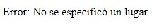
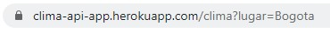
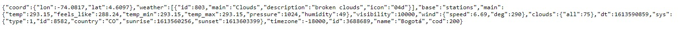

# Clima API

[](https://app.circleci.com/pipelines/github/danielrincon-m/AREP_PARCIAL1)
[](https://clima-api-app.herokuapp.com/clima)

## Descripción 🎇

Este proyecto se trata de una API en donde se puede consultar el clima actual de un sitio en concreto, el resultado será
devuelto en formato JSON, esto se logra consumiendo el servicio de [Open Weather Map](https://home.openweathermap.org/api_keys).

### Datos suministrados por la API

La API devuelve una cadena en formato JSON con los siguientes datos, entre otros:

 - Coordenadas
    - Latitud
    - Longitud
- Clima
    - Estado climático
    - Descripción del estado climático
- Temperatura
- Sensación térmica
- Temperatura mínima
- Temperatura máxima
- Presión
- Humedad 
- Visibilidad
- Viento 
    - Velocidad del viento 
    - Dirección del viento
- Zona horaria
- Código del lugar

### Cómo utilizar el programa

Al abrir el [sitio web de la API](https://clima-api-app.herokuapp.com/clima) nos encontraremos con un mensaje como este:



Esto se debe a que no hemos consultado ningún lugar en específico, esto lo haremos a través de la URL.

Como ejemplo, buscaremos los datos de la ciudad de Bogotá, esto lo haremos de la siguiente forma:



Y obtendremos un resultado como este, el cual contiene los datos climáticos de la ciudad de Bogotá:



## Cómo obtener el proyecto 📥

### Prerequisitos

Asegúrese de tener git instalado en su máquina, lo puede hacer desde la [página oficial][gitLink].

### Descarga del proyecto

Clone el proyecto utilizando el siguiente comando:

```
git clone https://github.com/danielrincon-m/AREP_PARCIAL1.git
```

## Correr las pruebas unitarias 🧪

### Prerequisitos

Un IDE que soporte proyectos Java, o una instalación de Maven en su sistema, puebe obtenerlo desde
la [página oficial.][mvnLink]

### Ejecución de pruebas

Las pruebas pueden ser ejecutadas desde la sección de pruebas de su IDE o si tiene maven puede navegar a la carpeta
principal del proyecto y ejecutar el comando

```
mvn test
```

## Documentación del código fuente 🌎

La documentación del proyecto puede ser encontrada en la carpeta [docs](/docs).

También puede ser generada con Maven, clonando el proyecto y ejecutando el siguiente comando:

```
mvn javadoc:javadoc
```

## Herramientas utilizadas 🛠️

* [IntelliJ IDE](https://www.jetbrains.com/es-es/idea/download/) - IDE de desarrollo
* [Maven](https://maven.apache.org/) - Manejo de Dependencias
* [JUnit](https://junit.org/junit4/) - Pruebas unitarias
* [GitHub](https://github.com/) - Repositorio de código
* [Open Weather Map](https://openweathermap.org/) - API de donde se extrajeron los datos de clima

## Autor 🧔

**Daniel Felipe Rincón Muñoz:** *Planeación y desarrollo del proyecto* -
[Perfil de GitHub](https://github.com/danielrincon-m)

## Licencia 🚀

Este proyecto se encuentra licenciado bajo **GNU General Public License** - consulte el archivo [LICENSE.md](LICENSE.md)
para más detalles.

<!-- 
## Acknowledgments 

* Hat tip to anyone whose code was used
* Inspiration
* etc
-->

[gitLink]: https://git-scm.com/downloads
[mvnLink]: https://maven.apache.org/download.cgi
